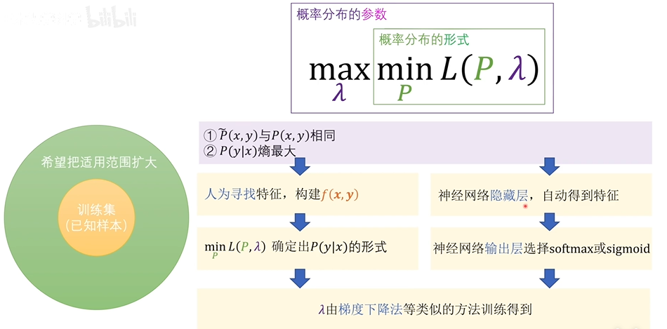

# 信息熵
信息熵是一个事件消除不确定性所需信息量的度量，熵越大，所需要的信息量越多，也就是说事件的不确定性越高，需要大量的信息才能让这个事件的结果确定下来，一个事件的信息熵定义如下：
$$
H(x) := -\sum^{n}_{i=1}p(x_i)log\bigl(p(x_i)\bigr)
$$
$p(x_i)$为$X=x_i$的概率，$log\bigl(p(x_i)\bigr)$为$p(x_i)$的信息量

### 信息量
信息量是对信息的度量  
事件概率越小，发生时带来的信息量就越大，比如，太阳从西升起，带来的信息就趋近于$\infty$，因为整个世界都颠倒了  
事件概率越大，发生时带来的信息量就越小，比如，太阳从东升起，带来的信息就趋近于0，因为这个是常识嘛  

#### 推导
信息量只是一个定义，只要能够自洽即可，那么信息量应该符合以下几点：  
1. 非负且随P增大而减少，概率为1，信息量为0  
2. 两个不相关事件x,y同时发生的概率为$p(x,y)=p(x)\cdotp(y)$，提供的信息为$H(x,y)=H(x)+H(y)$  
3. 一个事件可能出现N种情况，概率分别为$p(x_1),p(x_2),...,p(x_n)$，提供的信息量应该为$\sum^{n}_{i=1}p(x_i)H(x_i)$

根据第一条可以取概率的倒数，根据第二条可以取对数，再根据第三条，那么可得一个表示信息量的定义为
$$
H(x) := -\sum^{n}_{i=1}p(x_i)log\bigl(p(x_i)\bigr)
$$
底数为2或e，当然也可以进行其他定义，但就不是主流的表述方式  
为了描述两个系统之间差异将引出相对熵的概念

### 相对熵
相对熵（KL散度）用来衡量两个概率分布之间的差异
$$
D_{KL}(p||q)=\sum_{i=1}^np(x_i)log(\frac{p(x_i)}{q(x_i)})
$$
其中，p表示真实分布，q表示假设，差异越大，相对熵越大

### 交叉熵
$$
\begin{align*}
D_{KL}(p||q)
&= \sum_{i=1}^np(x_i)log(\frac{p(x_i)}{q(x_i)})\\
&= -(-\sum^{n}_{i=1}p(x_i)log\bigl(p(x_i))+(-\sum_{i=1}^np(x_i)log(q(x_i)))
\end{align*}
$$

前一项为p的熵，而后一部分就为交叉熵

$$
H(p,q)=-\sum_{i=1}^np(x_i)log(q(x_i))
$$

### 条件熵
条件熵H(Y|X)表示在已知随机变量X的条件下随机变量Y的不确定性
$$
\begin{align*}
H(Y|X) &= -\sum\limits_{x \in X}p(x)H(y|x)\\
& = -\sum\limits_{x \in X}p(x)\sum\limits_{y \in Y}p(y|x)logp(y|x) \\
& = -\sum\limits_{x \in X}\sum\limits_{y \in Y}p(x,y)logp(y|x)
\end{align*}
$$

### 最大熵
最大熵意味着不确定性最高，可以证明，如果事件的所有结果为均匀分布，也就是对一个事件不进行任何假设，那么这个时候这个事件的不确定最高，这样经验风险最小，偏离真实模型的可能性最小

# 指数族分布
指数族分布有：高斯分布、伯努利分布、二项分布、泊松分布、beta分布、Dirichlet分布、gamma分布等

$$
p(x|\eta) = b(x)exp\{\eta^TT(x)-A(\eta)\}
$$

指数族分布与之有关的知识：
- 充分统计量
- 共轭
- 最大熵
- 广义线性模型
- [概率图模型](../technique/pgm.md)
- 变分推断

## 充分统计量
假设X~$P(x;\theta)$，样本$(x_1,x_2,...,x_n)$独立同分布于$P(x;\theta)$，由样本可以得到的统计量包括两类，可以推出$\theta$的统计量和推导不出$\theta$的统计量，我们的目的是估计$\theta$，所以构造出能推出$\theta$的统计量即可  

假设掷一枚特殊的硬币，我们知道它服从二项分布B(1,p)，但是不知道参数，那么掷硬币100次，结果正面30次，反面70次，那么可以通过样本均值估计出来p=0.3，这就是可以推出$\theta$的统计量，推导不出$\theta$的统计量，比如说样本极差，在这个例子就是没用的，掷硬币不是正就是反，对估计$\theta$没有任何帮助  

简而言之，若T是充分统计量，则当我们知道T的值时，就可以通过一个随机化机制得到一组样本，而这个样本所包含的参数信息和原样本包含的一样，比如说，知道p就可以构造出二项分布，知道$\mu,\sigma^2$就可以构造高斯分布

### 矩
每一阶矩都告诉你一些关于分布的信息，在一定情况下，矩可以完全决定分布，也就是充分统计量，比如说二项分布，知道样本均值、高斯分布知道样本均值（一阶原点矩）和样本方差（二阶中心矩）

### 特征函数
可以认为每一阶矩就是一个分布的特征，由此引出特征函数这一概念
$$
\varphi_x(t)=E(e^{itx})
$$
之所以这么定义是因为根据泰勒展开式可以得到每一阶矩，特征函数包含了分布函数的所有矩，也就是包含了分布函数的所有特征
$$
\begin{align*}
\varphi_x(t) & =E(e^{itx})\\
& = E(1+\frac{itx}{1!}+\frac{(it)^2x^2}{2!}+...+\frac{(it)^nx^n}{n!})\\
& = 1+\frac{itE[x]}{1!}+\frac{(it)^2E[x^2]}{2!}+...+\frac{(it)^nE[x^n]}{n!}
\end{align*}
$$

## 最大熵
指数族分布符合最大熵条件，下面进行推导  

机器学习就是构建一个模型（函数），让其满足已知的事实（训练集），而对未知的部分不做任何假设（最大熵），这样就可以逼近真实的模型  

对于第一点，满足已知事实，就是要让p去逼近$\tilde{p}$，这一点可以使用特征函数进行求解，让其每阶矩都一样，$E_p(f(x))=E_{\tilde{p}}(f(x))$

对于第二点，从训练集中，我们可以知道$\tilde{p}(x)$和$\tilde{p}(x,y)$，而我们又知道$p(x,y)=p(x)p(y|x)$，对其进行替换，$\tilde{p}(x,y)=\tilde{p}(x)p(y|x)$，可以知道让$p(y|x)$熵最大即$max\ H(Y|X)$

但是对于已知事实（数据集），我们只知道概率，无法求期望（$E(x)=\sum{x_ip_i}$），需要设计一个随机变量，覆盖资料全集（这其实也是特征提取的过程），比如，二分类，我们将正类看作1，负类看作0，我们假设用M个事件覆盖全集，那么可以得到

$$
\begin{align*}
max\  & H(Y|X)\\
s.t.\ & E_p(f(x))-E_{\tilde{p}}(f(x))=0\\
s.t.\ & \sum_{y \in Y}p(y|x)=1
\end{align*}
$$

根据上述条件构造拉格朗日函数

$$
L(p,\lambda) = H(Y|X) + \lambda_0(1-\sum_{y \in Y}p(y|x)) + \sum^{m}_{i=1}\lambda_i\biggl(E_{\tilde{p}}(f(x))-E_p(f(x))\biggr)
$$

具体推导可以看[这个视频](https://www.bilibili.com/video/BV1cP4y1t7cP?spm_id_from=333.999.0.0)，其中包含[拉格朗日对偶问题](math.md)

$$
\underset{p}{min}\ \underset{\lambda}{max}\ L(p,\lambda) = \underset{\lambda}{max}\ \underset{p}{min}\ L(p,\lambda)
$$

我们对$\underset{p}{min}\ L(p,\lambda)$求解得到

$$
\begin{align*}
p(y|x)
& =\frac{e^{{\sum^{m}_{k=1}}\lambda_kf_k(x)}}{e^{1-\lambda_0}}\\
& = \frac{e^{\eta^T \cdot f(x)}}{e^{1-\lambda_0}}\\
& = exp\{\eta^Tf(x)-(1-\lambda_0)\}\\
& = b(x)exp\{\eta^TT(x)-A(\eta)\}
\end{align*}
$$

从上面可以得到$A(\eta)$用来配平的，保证概率和为1，$\eta$是一个自然参数，T(y)为充分统计量，h(x)一般取1，这就说明，在已知事实的情况下，最大熵的模型是指数族分布的，此外，$\sum_{y \in Y}p(y|x)=1$，那么可以得到$e^{1-\lambda_0}=\sum{e^{\eta^T \cdot f(x)}}$，得到以下形式

$$
p(y|x) = 
\frac{e^{\eta^Tf(x)}}{\sum{e^{\eta^T \cdot f(x)}}}
$$
对于多分类就是softmax函数,对于二分类就是sigmoid函数，也就是说如果神经网络使用softmax或sigmoid输出分类，实际上就默认了最大熵原则

随后我们对$\lambda$也就是$\eta$进行求解，一般来说，求解都比较困难，因此就使用梯度下降等方法进行求解

### 总结
最大熵是对不确定度的无偏分配

最大似然估计是对知识的无偏理解，我们的目的是去拟合数据集，因此MLE推导出来的结果一般作为损失函数
