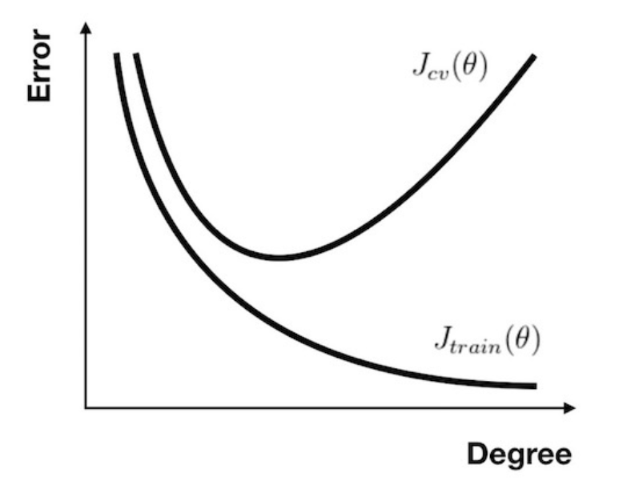
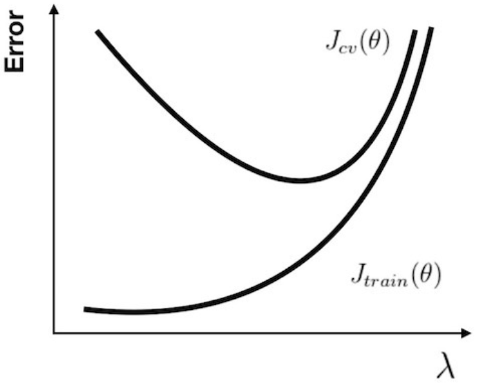
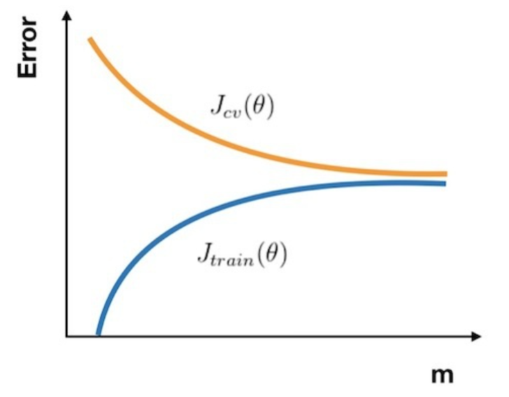
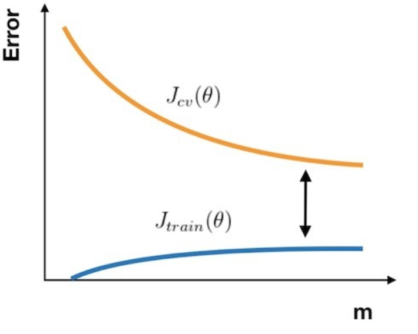

# 训练

## 常规方法
1. 首先使用比较简单粗暴的模型进行训练
2. 如果效果不好，去验证集上观察
3. 根据观察结果，确定优化方案，集训进行尝试
4. 选择效果最好的模型放到测试集中查看效果，效果不好回到2

## 判断拟合

### 方差和偏差
方差: 描述模型对于给定值的输出稳定性，高方差就意味着过拟合  
偏差：描述模型输出结果的期望与样本真实结果的差距，高偏差就意味着欠拟合  

### 最高项次数

### 正则系数

### 学习曲线
高偏差

高方差

### 应对方法
#### 高方差
1. 采集更多的样本数据  
2. 减少特征数量，去除非主要的特征  
3. 增加正则化参数  

#### 高偏差
1. 引入更多的相关特征  
2. 采用多项式特征  
3. 减小正则化参数  

# 优化

## 特征缩放
[特征缩放](https://blog.csdn.net/weixin_43008804/article/details/103087447)能加快收敛速度，但特征缩放后训练的模型，预测时要将数据进行缩放再进行预测

## 低秩分解
低秩是指矩阵的秩相对矩阵的行数或列数而言很小，低秩矩阵的每行或者每列都可以用其他的行或者列线性表示，这说明这个矩阵包含了大量的冗余信息。因此可以对图像进行恢复或者去除噪音

## 批量梯度下降
1. 打乱数据集
2. 把数据分为若干个组
3. 按组来更新参数

### 批量梯度下降法
- 只有1个组，即每次对所有数据来求解梯度的方向
- 数据量大时，计算开销大

### 随机梯度下降
- 有M个组，即对每个数据求梯度
- 数据量大时，计算简单，但收敛速度慢
- 对于大数据量，一般1到10次就能得到很好的性能

### 小批量梯度下降法
- 有M/b（b一般为2到100之间）个组，按组进行梯度下降
- 减少单次计算开销，收敛速度较快

# 大规模机器学习
- 向量化
- 拆分阶段
- 上限分析

## 获得大量数据
- 自己或找人收集
- 开源数据集
- 人造数据集

## 上限分析
分析哪个阶段最值得你花时间，完善后提升最大

# 比较常用模型
线性模型：线性软间隔SVM(SVC)、线性岭回归、正则化逻辑回归
核模型：硬间隔SVM对偶、SVR、概率SVM
